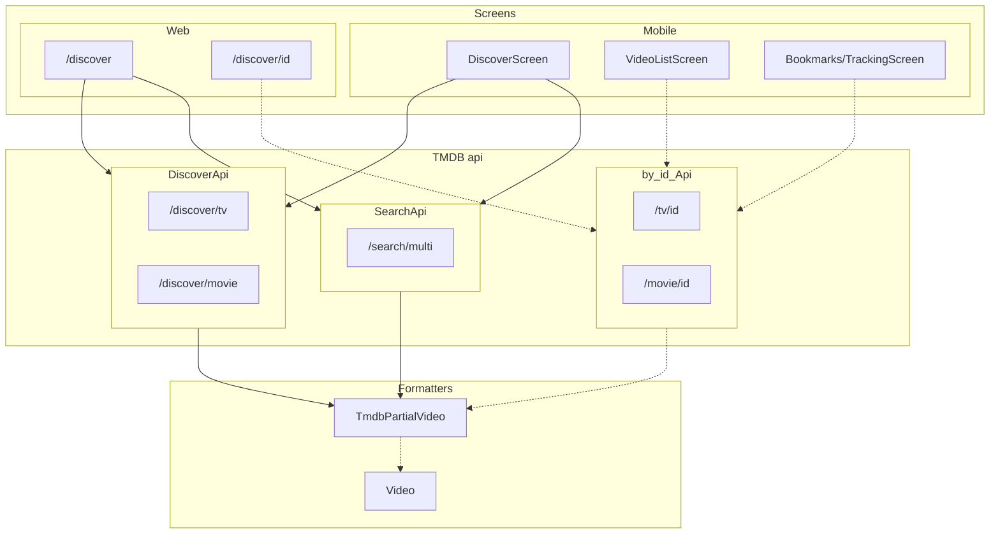

# Reelist

**Web / Discover:** This project allows user's to find new shows or movies to watch! The inspiration behind this was the many times I was finding something to watch, but getting many options from Streaming services that I did not have, or that were not available in the country I was visiting. See it in action on the Discover page: https://reelist.app/discover
Current Abilities:

- Find a specific show or movie
- Discover shows by region, by Streaming service, by Genre, or by video "type"

Tools: [React](https://react.dev/) [Tailwind](https://tailwindcss.com/) [Mobx](https://mobx.js.org/README.html) [Docker](https://www.docker.com/)
Data Source: [TMDB](https://www.themoviedb.org/)

**Mobile:** This project allows users to mark the shows they have watched, find shows or movies; create lists of shows and share them with friends, join a list, see public lists, see the estimated progress of the list, and keep each other up to date with what has been watched, hopefully to help facilitate discussions about episodes as well.
Current Abilities:

- [x] Find a specific show or movie
- [x] Create a list of shows and movies for friends to see
- [x] Mark individual episodes of shows as watched
- [x] Shared watched status with friends
- [ ] Discover shows by region, by Streaming service, by Genre, or by video "type"
- [ ] Get notifications when a list item has been added or removed
- [ ] Get notifications when a list item has been watched

Tools: [React Native](https://reactnative.dev/) [Nativebase](https://nativebase.io/) [Mobx](https://mobx.js.org/README.html)
Data Source: [TMDB](https://www.themoviedb.org/) [Supabase](https://supabase.com/)

**Reelist Codebase**
This is a mono repo powered by NX for web and mobile where the `lib/` folder is shared between the `mobile` and `server` projects. Both projects are initiated using Inversify to easily instantiate any platform specific tools (like storage).

Tools: [NX](https://nx.dev/) [Inversify](https://inversify.io/)

This readme is powered by [https://stackedit.io/app](https://stackedit.io/app)

**Supabase:** [Supabase cli docs](https://supabase.com/docs/reference/cli/installing-and-updating) 

## Funding

This project receives no funding at all. This is 100% a passion project with no expected revenue, not even in coffee form. 
  
## Getting started  
clone the project, and run `yarn install` in the root directory

`yarn prep` will ensure that the secrets file exists and has some base (useless) values; actual values can be received from project owners (or go create your own) 

### Mobile:
 `yarn mobile:start` this should boot up the react native setup and allow you to run via android or ios

### Website:
`yarn server:start` this will start up a next js instance on the localhost (dev:4200 staging:3001)
  
## Available Scripts  
  
This project uses [NX](https://nx.dev/) to handle building and bundling. Using the Visual Studio Code plugin is the best way to interact with nx
  
## Creating a new Library  
Creating a new library "examples" can be done by running  
`nx generate library examples --appProject=apps/mobile --importPath=@reelist/examples --directory=libs`   
## Import aliases  
  
###  Mobile:  
  
Imports like `import Example from '@reelist/Example'` are handled by tsconfig files, either through tsconfig.base or through tsconfig.lib or tsconfig.app
  
because mobile and server handles their own version of `~/*`, we need to copy the custom import paths used in the `tsconfig.base.json` into our `tsconfig.app.json`  
  
Currently; this maps directly to any directory in the `src` directory: Example: `/apps/mobile/src/feature/FeatureExample` would be mapped to `~/feature/FeatureExample`  
  
### Libraries:   
Each library should have its own import alias: `libs/apis` should be `@reelist/apis`, this allows all the projects (including the libraries) to follow the same import structure   
  
  ## Misc  
  
- Google play store feature graphic generated using: http://tools.neko2me.net/efgg/  
  
## Building the project  
  
### Android:  
  
Previous: builds could be started through the nx console, or manually running `nx run mobile:build-android` (with the optional `--apk` flag)  
  
Current: Due to some forced hermes issues, this command can only be run manually from `/reelist`: `ENTRY_FILE="../../src/main.tsx" nx run mobile:build-android`   
Build output locations are    
- apk: `apps/mobile/android/app/build/outputs/apk/release`  
- aab: `apps/mobile/android/app/build/outputs/bundle/release`  
  

### Server:

To run locally,  `yarn nx run server:deploy-prod-local` should stop your local docker, create a new build, and begin running the new docker instance

If your new docker server fails use `docker logs $(docker ps -aqf "ancestor=reelist-server")` to see the logs of the crashed server

